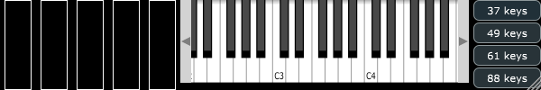

# ShowMIDI

This is a very simple MIDI effect (can be inserted in the MIDI effects slot of Apple Logic Pro X) to visualize MIDI input activity on a keyboard, pitch and mod wheels. The "AW" version features three extra indicators for MIDI CC's 2, 4, and 67.

I developed this for [John Lemkuhl](https://www.pluginguru.com/) to use in his [YouTube videos](https://www.youtube.com/channel/UCuKxBfrjXMDZZfuP_bfSHFA), where it's useful to be able to see the actual keyboard input (often quite simple) that results in a particular sound (often complex due to intricate programming).

 * Use buttons at right to set the keyboard size (3-, 4-, 5-octave, or full 88-key piano)
 * Drag resize grip at bottom right corner to resize the GUI

See also [ShowMIDI_CC](https://github.com/getdunne/ShowMIDI_CC).

Requires [JUCE 5.x](https://shop.juce.com/get-juce), hence subject to the GNU GPL v3 license. Use the *Projucer* to generate the necessary projects, e.g. VST2 for Windows, Audio Unit for Mac.

If you can't or don't want to build these plug-ins from source, pre-built executables are available in the [Prebuilt folder](Prebuilt).
